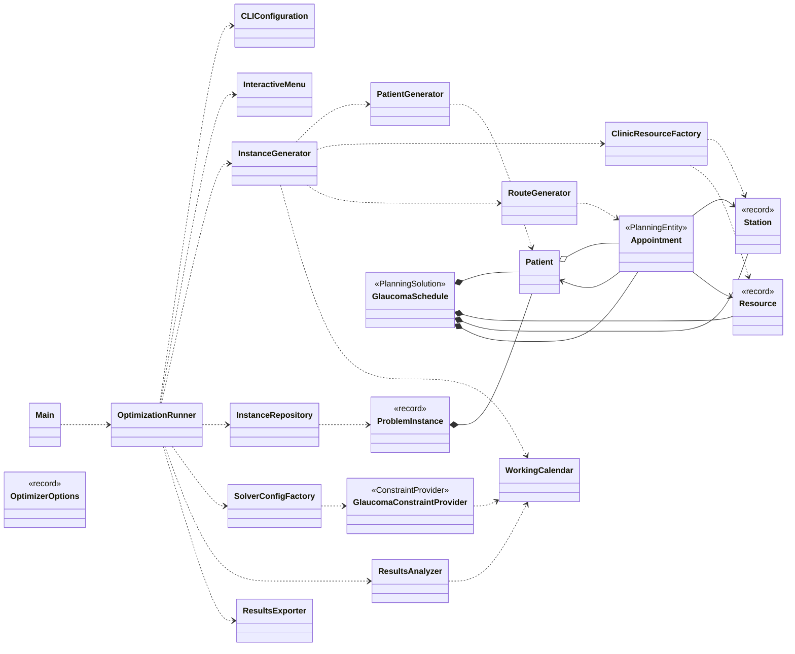

# Tiempo es visión
### Optimización del cribado de glaucoma mediante metaheurísticas

Optimizador del circuito asistencial de diagnóstico y seguimiento del **glaucoma**, desarrollado como Trabajo de Fin de Grado (TFG) en la Universidad de La Laguna (ULL).

El programa modela la derivación de pacientes entre Centros de Atención Especializada (CAE) y el Complejo Hospitalario Universitario de Canarias (CHUC) como un problema de optimización combinatoria, resuelto mediante [Timefold Solver](https://timefold.ai/), para evaluar distintas configuraciones de agenda y su impacto en los tiempos de diagnóstico.

## Tabla de contenidos

- [Objetivo del proyecto](#objetivo-del-proyecto)
- [Funcionamiento general](#funcionamiento-general)
- [Modelo de optimización](#modelo-de-optimización)
- [Arquitectura y estructura del proyecto](#arquitectura-y-estructura-del-proyecto)
- [Diagrama de clases](#diagrama-de-clases)
- [Tecnologías empleadas](#tecnologías-empleadas)
- [Requisitos previos](#requisitos-previos)
- [Compilación](#compilación)
- [Ejecución](#ejecución)
- [Datos de entrada y salida](#datos-de-entrada-y-salida)
- [Limitaciones conocidas y trabajo futuro](#limitaciones-conocidas-y-trabajo-futuro)
- [Autoría](#autoría)

## Objetivo del proyecto

En la práctica asistencial, un paciente con sospecha o diagnóstico de glaucoma pasa por una secuencia de citas (triaje, pruebas diagnósticas, consultas) que pueden repartirse entre su CAE de referencia y, si su gravedad lo requiere, el CHUC. Cuanto más tarda ese circuito en completarse y llegar al diagnóstico, mayor es la progresión de la enfermedad, que llega a la ceguera total en los casos más graves.

Este proyecto persigue:

1. **Generar poblaciones sintéticas de pacientes** con perfiles clínicos realistas (nivel de gravedad, procedencia de urgencias, necesidad de derivación al CHUC y de revisiones de seguimiento), a partir de distribuciones de probabilidad basadas en el estudio del problema real.
2. **Modelar el circuito clínico como un problema de planificación** (scheduling): cada paciente genera una ruta de citas que deben asignarse a recursos (doctores, máquinas de pruebas) y estaciones a lo largo de un horizonte temporal, respetando capacidades y precedencias.
3. **Comparar configuraciones de agenda alternativas**: agenda estándar frente a una "agenda paralela" monográfica de glaucoma con distintas frecuencias mensuales (2, 3 o 4 días al mes), para cuantificar su efecto sobre el tiempo de diagnóstico y el número de infactibilidades médicas (pacientes cuyo diagnóstico excede el plazo clínicamente asumible según su gravedad).

## Funcionamiento general

Al arrancar, el programa ([`OptimizationRunner`](src/com/glaucoma/app/OptimizationRunner.java)) sigue estas fases:

1. **Arranque**: obtiene qué hacer (generar una instancia nueva o cargar una existente) a partir de los argumentos de línea de comandos, o mediante un menú interactivo si no se reciben.
2. **Preparación de la instancia**: genera una población de pacientes aleatorios ([`PatientGenerator`](src/com/glaucoma/app/PatientGenerator.java)) o la carga desde un JSON existente ([`InstanceRepository`](src/com/glaucoma/app/InstanceRepository.java)).
3. **Generación del escenario**: por cada configuración de la batería, construye el catálogo de estaciones y recursos físicos ([`ClinicResourceFactory`](src/com/glaucoma/app/ClinicResourceFactory.java)) y la ruta clínica de cada paciente ([`RouteGenerator`](src/com/glaucoma/domain/RouteGenerator.java)).
4. **Optimización**: el motor de Timefold ([`SolverConfigFactory`](src/com/glaucoma/app/SolverConfigFactory.java)) busca la asignación de horarios que minimiza las infracciones de las restricciones definidas en [`GlaucomaConstraintProvider`](src/com/glaucoma/solver/GlaucomaConstraintProvider.java).
5. **Batería de pruebas**: se ejecutan 4 configuraciones sobre la misma población — agenda estándar, y agenda paralela con 2, 3 y 4 días al mes — reutilizando el mismo solver.
6. **Análisis y exportación**: por cada configuración, se calculan métricas de calidad ([`ResultsAnalyzer`](src/com/glaucoma/app/ResultsAnalyzer.java)) y se exportan a JSON ([`ResultsExporter`](src/com/glaucoma/app/ResultsExporter.java)).

## Modelo de optimización

El problema se modela con Timefold como una entidad de planificación `Appointment` (cita), cuya variable de decisión es el minuto de inicio `t`, dentro de una solución `GlaucomaSchedule` que agrupa pacientes, recursos, estaciones y citas.

Las restricciones definidas en `GlaucomaConstraintProvider` son:

| Restricción                         | Tipo | Descripción                                                                          |
|-------------------------------------|------|--------------------------------------------------------------------------------------|
| `sameCenterSameDayTests`            | Hard | Las pruebas del mismo centro deben realizarse el mismo día                           |
| `testsConsultationsPrecedence`      | Hard | Las pruebas deben ocurrir en un día distinto y anterior a la consulta                |
| `resourcesCapacity`                 | Hard | Un recurso no puede atender dos citas solapadas en el tiempo                         |
| `attendOnlyAfterArrival`            | Hard | Un paciente no puede ser atendido antes de llegar al sistema                         |
| `sameDayAppointmentsNoSevere`       | Hard | Pacientes no urgentes no pueden tener dos citas el mismo día operativo               |
| `severeTransportMargin`             | Hard | Pacientes urgentes con citas que coinciden el mismo día necesitan margen de traslado |
| `HUCDoctorsWeeklySurgeries`         | Hard | Un médico del CHUC no está disponible en su día de quirófano asignado                |
| `ParallelScheduleAvailabilityLogic` | Hard | Disponibilidad de médicos según sustituciones/traslados en días de agenda paralela   |
| `diagnosisCriticalPeriod`           | Soft | Penaliza superar el plazo crítico máximo permitido (infactibilidad médica)           |
| `minimizeDiagnosisTime`             | Soft | Minimiza el tiempo total hasta el diagnóstico final, en días reales                  |

El calendario laboral ([`WorkingCalendar`](src/com/glaucoma/domain/WorkingCalendar.java)) traduce minutos de simulación a días reales de calendario, descontando fines de semana y una proporción de festivos, para que las métricas de tiempo de diagnóstico reflejen días naturales y no solo minutos operativos.

## Arquitectura y estructura del proyecto

```
src/
├── Main.java                                    Punto de entrada de la aplicación
│
└── com/glaucoma/
    ├── app/                                      Orquestación, generación de instancias, CLI y resultados
    │   ├── OptimizationRunner.java                Orquesta la ejecución completa del programa
    │   ├── CLIConfiguration.java                  Parseo de argumentos de línea de comandos
    │   ├── InteractiveMenu.java                   Menú interactivo por consola
    │   ├── InstanceGenerator.java                 Orquesta la generación de instancias y escenarios
    │   ├── PatientGenerator.java                  Genera pacientes aleatorios (estratificación clínica)
    │   ├── ClinicResourceFactory.java              Crea el catálogo de estaciones y recursos físicos
    │   ├── InstanceRepository.java                Persiste y carga instancias en JSON
    │   ├── ProblemInstance.java                   Población base de un problema (record)
    │   ├── OptimizerOptions.java                  Opciones de un escenario de optimización (record)
    │   ├── ResultsAnalyzer.java                   Calcula las métricas de calidad de una agenda resuelta
    │   ├── ResultsExporter.java                   Exporta a JSON los resultados de la batería
    │   └── SolverConfigFactory.java               Configura el motor de optimización de Timefold
    │
    ├── domain/                                    Modelo de dominio y entidades de planificación de Timefold
    │   ├── Patient.java                            Paciente: datos clínicos y ruta de citas
    │   ├── Appointment.java                       Cita (@PlanningEntity)
    │   ├── GlaucomaSchedule.java                  Agenda completa a resolver (@PlanningSolution)
    │   ├── Station.java                            Estación del circuito clínico (record)
    │   ├── Resource.java                           Recurso físico: doctor o máquina (record)
    │   ├── RouteGenerator.java                    Genera la ruta clínica de cada paciente
    │   └── WorkingCalendar.java                   Traduce minutos de simulación a días de calendario real
    │
    └── solver/
        └── GlaucomaConstraintProvider.java        Restricciones duras y blandas del problema
```

## Diagrama de clases



Vista simplificada (dependencias y relaciones de composición/asociación principales). La versión completa, con atributos y métodos de cada clase y agrupada por paquete, está en [`docs/diagrams/class-diagram.drawio`](docs/diagrams/class-diagram.drawio) — puede editarse en [draw.io / diagrams.net](https://app.diagrams.net/).

## Tecnologías empleadas

- **Java 21**
- **Maven** — gestión de dependencias y construcción del proyecto
- **[Timefold Solver](https://timefold.ai/) 1.12.0** — motor de optimización por restricciones (metaheurísticas)
- **Jackson Databind** — serialización/deserialización de instancias y resultados en JSON
- **Logback** — logging

## Requisitos previos

- JDK 21 o superior
- Maven 3.8 o superior

## Compilación

```bash
mvn clean package
```

Genera un JAR ejecutable con todas las dependencias empaquetadas (gracias al `maven-shade-plugin`) en `target/TimeIsSight-1.0-SNAPSHOT.jar`. Equivalente al script [`scripts/compilation`](scripts/compilation).

## Ejecución

### Con el JAR ya compilado

```bash
java -jar target/TimeIsSight-1.0-SNAPSHOT.jar [opciones]
```

### Con Maven, sin empaquetar

```bash
mvn compile exec:java -Dexec.mainClass="Main" -Dexec.args="[opciones]"
```

### Opciones de línea de comandos

| Opción                  | Descripción                                                                                                        |
|-------------------------|--------------------------------------------------------------------------------------------------------------------|
| _(sin argumentos)_      | Abre el menú interactivo paso a paso                                                                               |
| `-h`, `--help`          | Muestra la ayuda                                                                                                   |
| `-n <pacientes> <días>` | Genera una nueva instancia con la cantidad de pacientes y el horizonte de días indicados                           |
| `-e <archivo>`          | Carga una instancia existente desde la carpeta `instances/`                                                        |
| `-t <minutos>`          | Tiempo máximo de ejecución del solver por cada una de las 4 configuraciones de la batería (60 minutos por defecto) |

Ejemplo — genera una instancia de 500 pacientes a lo largo de 365 días, con 30 minutos de solver por configuración:

```bash
java -jar target/TimeIsSight-1.0-SNAPSHOT.jar -n 500 365 -t 30
```

Si no se indica ningún argumento, se abre un menú interactivo que permite elegir entre generar una instancia nueva o cargar una ya existente.

### Scripts de conveniencia

- [`scripts/compilation`](scripts/compilation) — atajo para `mvn clean package`.
- [`scripts/batch_execution.sh`](scripts/batch_execution.sh) — lanza una tanda de 5 ejecuciones consecutivas del JAR ya compilado (`target/TimeIsSight-1.0-SNAPSHOT.jar`) sobre una instancia fija (`-e P3750_D90_first_instance.json -t 60`), pensado para ejecuciones largas y desatendidas en una máquina de laboratorio: registra cada ejecución en un log con marca de tiempo y envía notificaciones a un topic de [ntfy.sh](https://ntfy.sh/) al empezar, tras cada ejecución (éxito/error) y al terminar, además de una alarma si el proceso se interrumpe.
- [`scripts/run`](scripts/run) — pensado para lanzar la tanda anterior en segundo plano con `nohup` (de forma que sobreviva al cierre de la sesión SSH).

## Datos de entrada y salida

El programa crea automáticamente (si no existen) y usa tres carpetas en la raíz del proyecto:

- **`instances/`** — instancias de pacientes generadas o cargadas, en JSON (`P<pacientes>_D<días>_<fecha>.json`).
- **`executions/`** — resultado de cada batería de optimización ejecutada, en JSON (`results_P<pacientes>_D<días>_<fecha>.json`), con los metadatos del escenario y el resultado de cada una de las 4 configuraciones probadas (tiempo de ejecución, infactibilidades médicas, tiempo medio de diagnóstico, citas sin asignar por falta de tiempo o de capacidad).
- **`output/`** — registro completo de la consola de cada ejecución (`console_register_<fecha>.log`), ya que el programa redirige la salida estándar y de error a fichero al arrancar.

## Limitaciones conocidas y trabajo futuro

- El catálogo de recursos físicos (doctores, máquinas por centro) y las probabilidades de estratificación clínica de `PatientGenerator` están fijados en el código, no son configurables desde fuera del programa.
- El tiempo máximo de ejecución del solver (`-t`) se aplica por igual a las 4 configuraciones de la batería; no admite tiempos distintos por configuración.

## Autoría

Carolina Acosta Acosta — Trabajo de Fin de Grado, Universidad de La Laguna, 2026.
